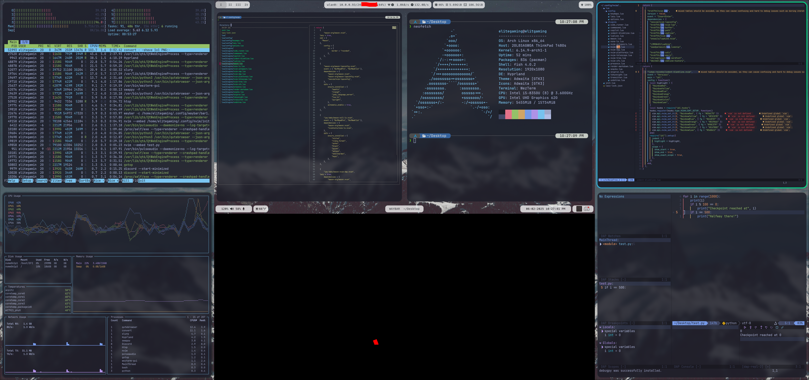

# Arch Linux / Debian / I3 / NVIM / FISH Dotfiles

**Setup I3 and GUI Apps If Root**
[setupgui.sh](https://github.com/sheeeeee33eeesh/DotFiles/blob/master/scripts/setupgui.sh)

**Copy Config Files For Non Root Users**
[nonroot-setupconsole.sh](https://github.com/sheeeeee33eeesh/DotFiles/blob/master/scripts/nonroot-setupconsole)

**Setup CLI Environment NVIM / FISH**
[setupconsole.sh](https://github.com/sheeeeee33eeesh/DotFiles/blob/master/scripts/setupgui.sh)

**Docker Image**
[DockerFile](https://github.com/sheeeeee33eeesh/DotFiles/blob/master/setupconsole.sh)
[dockerhub](https://hub.docker.com/r/tylber5338/shee3eeeshkali)
